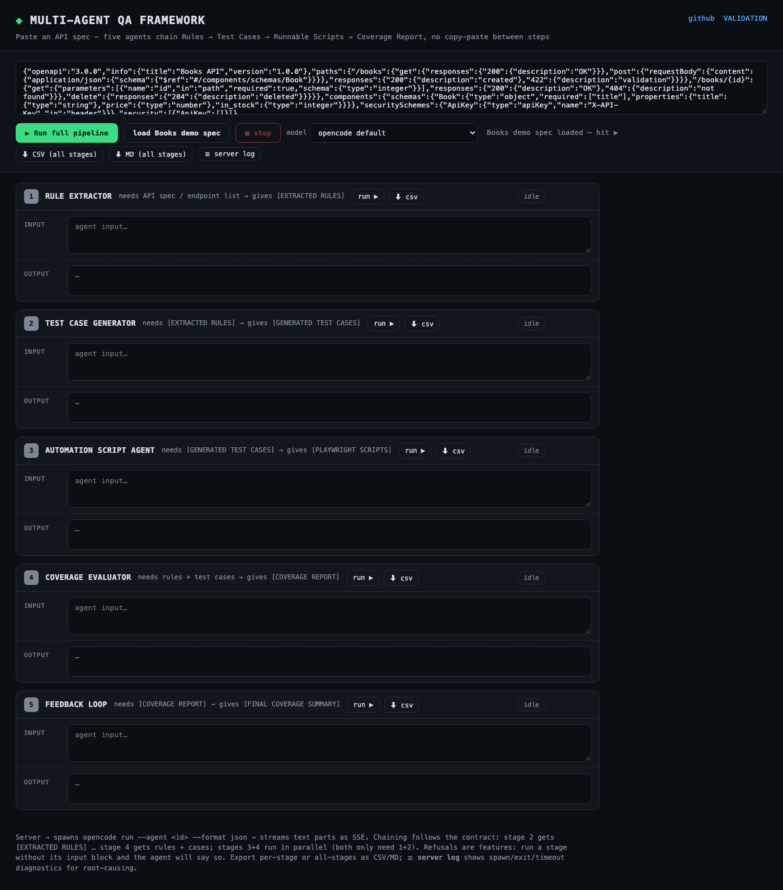

# Multi-Agent QA Framework

A reusable 5-agent pipeline that **thinks, evaluates, and improves test coverage** — not just generates test cases.

```
API spec ──▶ [1] Rule Extractor ──▶ [2] Test Case Generator ──▶ [3] Automation Script Agent
                                                                      │
        [FINAL COVERAGE SUMMARY] ◀── [5] Feedback Loop ◀── [4] Coverage Evaluator
```

Each agent has a hard **input/output contract** (labeled blocks), so you can run the whole pipeline at once — or any single agent on its own.

**Universal by design:** any application domain (web, mobile backend, IoT, payments, internal services), any HTTP style (REST / GraphQL-over-HTTP / SOAP / webhooks), spec as Swagger/OpenAPI, Postman/HAR, GraphQL SDL, gRPC `.proto`, README, endpoint list or base URL. The automation target defaults to Playwright/JS and swaps to JUnit, pytest, Karate, Cypress, k6, … just by naming it.

## The 5 agents

| # | Agent | Input | Output | Prompt file | opencode agent |
|---|-------|-------|--------|-------------|----------------|
| 1 | Rule Extractor | API spec (Swagger/README/URL) | `[EXTRACTED RULES]` | `prompts/agent-1-rule-extractor.md` | `.opencode/agent/rule-extractor.md` |
| 2 | Test Case Generator | `[EXTRACTED RULES]` | `[GENERATED TEST CASES]` | `prompts/agent-2-test-case-generator.md` | `.opencode/agent/test-case-generator.md` |
| 3 | Automation Script Agent | `[GENERATED TEST CASES]` | `[PLAYWRIGHT SCRIPTS]` | `prompts/agent-3-automation-script-agent.md` | `.opencode/agent/automation-script-agent.md` |
| 4 | Coverage Evaluator | `[EXTRACTED RULES]` + `[GENERATED TEST CASES]` | `[COVERAGE REPORT]` | `prompts/agent-4-coverage-evaluator.md` | `.opencode/agent/coverage-evaluator.md` |
| 5 | Feedback Loop | `[COVERAGE REPORT]` | `[FINAL COVERAGE SUMMARY]` | `prompts/agent-5-feedback-loop.md` | `.opencode/agent/feedback-loop.md` |

### What each agent actually does

**1 · Rule Extractor — turns a spec into testable ground truth.**
Reads any spec shape (OpenAPI/Swagger JSON, Postman collection, HAR, GraphQL SDL, gRPC `.proto`, README, endpoint list, or a bare base URL — it will fetch `<base>/openapi.json` itself if given a URL) and emits the rules a tester would argue from: full endpoint inventory with params/body/auth, the exact response-code contract (body shape per status, not just the code), documented vs. *observed* behavior kept separate, business rules and validation limits (ranges, formats, enums), and every spec ambiguity tagged `FINDING`/`BUG` — e.g. "create returns 200, not the REST-typical 201". Read-only probing of a live base URL is allowed; without any spec it refuses and asks for one.

**2 · Test Case Generator — rules → a reviewable test matrix.**
Expands every rule into `TC-NNN | method+path | scenario | input | expected` rows covering all six required categories (happy path, negative, boundary, auth/permissions, edge, response validation), keeps a 1:1 mapping from each FINDING/rule to at least one TC, and honestly marks expectations the spec never documented as *unverified/probe* instead of inventing certainty. It never invents behavior that isn't in the rules block.

**3 · Automation Script Agent — test matrix → executable tests.**
Compiles each TC row into one runnable test with a 1:1 id mapping (`'TC-001 - …'`), asserting both the status code and the response-body contract (field presence, types, pinned values), plus shared helpers for the API's error shapes, a `playwright.config.js` with `baseURL`/`retries`, and a `NOTES` section that flags questionable test rows rather than silently changing expectations. Target stack is a parameter: Playwright/JS by default, JUnit, pytest, Karate, Cypress, k6… just by naming it. Operates under a zero-tool policy — everything is composed from the input block alone.

**4 · Coverage Evaluator — the auditor.**
Audits Agent 2's cases *against* Agent 1's rules (it needs both blocks): endpoint coverage, status-code coverage per endpoint, scenario coverage, a **weighted** coverage percentage, a concrete gap list (`G1…Gn`, each naming method/path/input/expected status), and an overall risk level. It measures, it doesn't generate — that's why it refuses to run without both inputs.

**5 · Feedback Loop — the "improves" half of the pitch.**
Takes the coverage report, closes every gap with new TCs *and* their automation scripts in the same target stack, re-measures coverage after each iteration, and stops above the threshold (default >90%), emitting `[FINAL COVERAGE SUMMARY]` with totals, final %, scripts-ready status, and honest remaining risks. One demo run: 97% → G1–G13 → 19 new cases (TC-073…TC-091) → **100%**.

---

## How to use

### Option A — Full pipeline in one shot (any LLM)

Paste **`prompts/MASTER_PROMPT.md`** as your prompt in ChatGPT / Claude / opencode, then provide the API spec when asked. All 5 agents run in sequence automatically.

### Option B — Reuse agents individually (any LLM)

Paste **one** agent file from `prompts/` as your prompt, then provide its required input:

| You have | Paste this prompt | Then provide |
|---|---|---|
| An API spec | `agent-1-rule-extractor.md` | the spec (or a base URL) |
| `[EXTRACTED RULES]` | `agent-2-test-case-generator.md` | the rules block |
| `[GENERATED TEST CASES]` | `agent-3-automation-script-agent.md` | the test-case block |
| rules + test cases | `agent-4-coverage-evaluator.md` | both blocks |
| `[COVERAGE REPORT]` | `agent-5-feedback-loop.md` | the report block |

Chaining example — run only coverage, then only gap-closing:

```
You:  <paste agent-4-coverage-evaluator.md>
You:  [EXTRACTED RULES] ... <paste block from agent 1>
      [GENERATED TEST CASES] ... <paste block from agent 2>
AI:   [COVERAGE REPORT] ...
You:  <paste agent-5-feedback-loop.md>
You:  [COVERAGE REPORT] ... <paste block above>
AI:   new TCs + scripts + [FINAL COVERAGE SUMMARY]
```

Rules that make reuse reliable:
- Each agent refuses to run without its required input and tells you what's missing.
- Outputs are **labeled blocks** — always paste the whole block; downstream agents never see the original spec or earlier conversation.
- Never edit a labeled block before passing it on (renumbering TCs breaks Agent 3/4 traceability).

### Option C — Inside opencode (this repo as a project)

Open this repository as your opencode project and the agents are available immediately:

- **Run the whole pipeline:** `/qa-pipeline <paste spec or base URL>` (or `/qa-pipeline` alone and paste when asked)
- **Run one agent:** select it as your chat agent, or dispatch it as a subagent — `rule-extractor`, `test-case-generator`, `automation-script-agent`, `coverage-evaluator`, `feedback-loop`
- **Chain manually:** run one agent, then start a new turn with the next agent and paste the labeled output

**Install globally** (available in every project):

```bash
mkdir -p ~/.config/opencode/agent ~/.config/opencode/command
cp .opencode/agent/*.md ~/.config/opencode/agent/
cp .opencode/command/qa-pipeline.md ~/.config/opencode/command/
```

Restart opencode after adding or editing agent/command files — config is loaded at startup, not hot-reloaded.

### Option D — Web UI (one HTML page, same agents)

```bash
node examples/web-ui/server.js      # zero npm dependencies; prints the URL
open http://127.0.0.1:3000
```

**Requirements:** `opencode` installed and authenticated (the server shells out to it);
run from anywhere — paths resolve relative to the repo.

How to use:
1. **Paste a spec** into the top box — OpenAPI/Swagger, Postman/HAR, GraphQL schema,
   gRPC `.proto`, endpoint list, README, or base URL — or click **load Books demo spec**.
2. **Pick a model** (optional) — the `model` input is pre-filled from `GET /api/models`
   and remembered in localStorage; leave it empty to use opencode's default. The opencode
   **free tier** can intermittently refuse headless CLI runs (HTTP 403
   *"free tier can only be used from within OpenCode"*) — if that happens the UI shows a
   hint; pick another free model (e.g. `opencode/mimo-v2.6-flash-free`) or run the pipeline
   inside the opencode app instead.
3. **▶ Run full pipeline** — the five stage cards stream their labeled blocks;
   stages **3 and 4 run in parallel** (both only need stages 1+2), which typically saves
   the longest stage. Each output auto-fills the next stage's input (stage 4 receives
   rules + cases together, per its contract). Per-card: live elapsed timer, token count.
4. **Run a single stage** with its **run ▶** button — clear an input first to see a live
   **contract refusal** (amber pill). **■ stop** kills all running children; refresh is safe.
5. **Export results** — per-stage **⬇ csv** (pipe tables become spreadsheet rows, UTF-8 BOM
   so Excel opens it directly) or **⬇ CSV (all stages)** / **⬇ MD (all stages)** in the top
   bar. Outputs that contain `A | B | C` tables also get a **table** view toggle.
6. **Root-cause with logs** — **☰ server log** opens the diagnostics drawer: the server's
   spawn/exit log (pid, first-byte ms, exit code, stop reason, char counts — everything
   needed to tell a tool-loop from a model timeout from a 403) plus each stage's saved
   artifact. The server self-logs to `/tmp/qa-ui.log` (`QA_UI_LOG` overrides), so no shell
   redirection is needed. Per-agent hard timeout: `QA_UI_AGENT_TIMEOUT_MS` (default 600000).

The server is a thin proxy: it spawns the *same* `.opencode/agent/*.md` files via
`opencode run --agent <id> --format json` and forwards the text parts as SSE —
no separate API key, no second copy of the prompts. Empty model output is never chained
onward (placeholder input + one retry instead), so the next stage always gets a real block.

**Refresh-safe:** a closed tab or refresh does *not* cancel a running pipeline — the
server keeps going, persists every completed stage to `/tmp/qa-ui-run.json` (plus the
per-stage artifacts), and the UI restores results on next page load (`GET /api/last-run`,
`GET /api/status`); while a background run is active the page polls and updates its cards.
**■ stop** (`POST /api/cancel`) is the only thing that kills running agents.

**Known limitation:** agent frontmatter `permission:` blocks (e.g. `bash: deny`) currently
break *headless* `opencode run` runs on the free tier (HTTP 403 before any tool call).
Tool discipline is therefore enforced in the prompt bodies + `steps:` iteration caps;
re-enable frontmatter permissions only when running with your own provider key.

**HTTP API** (for scripting/demos): `POST /api/run {agent,input,model}` and
`POST /api/pipeline {input,model}` stream SSE (`meta|stage|chunk|stage_done|done|error|cancelled`),
`POST /api/cancel`, `GET /api/agents`, `GET /api/models`, `GET /api/logs[?stage=N]`, `GET /health`.



E2E checks (with the server running):
- `node examples/web-ui/e2e.mjs` — drives the **full pipeline** in headless Chromium,
  asserts 5/5 stages complete + coverage badge, saves the screenshot above (~15–30 min
  depending on model speed).
- `SCREENSHOT_ONLY=1 node examples/web-ui/e2e.mjs` — screenshot without running agents.

---

## Worked example

`examples/prompt2production-ecommerce.md` — a condensed real run of all 5 agents against
[Prompt2Production](https://github.com/Madhusudan-1990/Prompt2Production)'s e-commerce API
(`https://ecommerce-api.fastapicloud.dev`), showing expected output shape for every labeled block,
including the coverage-gaps iteration.

**`examples/playwright-suite/`** — the actual 90-test suite that run produced, executable:
`cd examples/playwright-suite && npm i && npx playwright test` → **90 passed**.

## Validation

Every agent file was smoke-tested standalone in a fresh context, its refusal contract verified,
the generated suite executed live, and opencode's discovery of the agents confirmed —
see **[VALIDATION.md](VALIDATION.md)** for the evidence (5/5 smoke, 5/5 refusals, 90/90 tests green).

## Repository layout

```
multi-agent-qa-framework/
├── README.md                     # this file
├── VALIDATION.md                 # evidence: 5/5 smoke, 5/5 refusals, 90/90 green, opencode load
├── prompts/                      # portable, LLM-agnostic prompts (source of truth)
│   ├── MASTER_PROMPT.md          # all 5 agents in one paste-able prompt
│   └── agent-{1..5}-*.md         # one file per agent
├── .opencode/
│   ├── agent/*.md                # same prompts wrapped as opencode agents (@-invocable)
│   └── command/qa-pipeline.md    # /qa-pipeline = full run with $ARGUMENTS
└── examples/
    ├── prompt2production-ecommerce.md   # golden worked example (5 labeled outputs)
    ├── playwright-suite/                # the real 90-test suite from that run
    └── web-ui/                          # HTML frontend over the same agents (SSE, no deps)
        ├── server.js                    # spawns `opencode run --agent …`, streams as SSE
        ├── index.html                   # single-page UI: pipeline + per-stage runs
        └── e2e.mjs                      # headless-browser full-pipeline check
```

> `prompts/` and `.opencode/agent/` contain the same instructions in two packaging formats.
> If you edit an agent, update **both** files (the opencode file adds YAML frontmatter:
> `description` + `mode: all`).

## Extending

- **Add a 6th agent:** copy an existing `prompts/agent-N-*.md` + `.opencode/agent/*.md` pair, define its input label, and add it to `MASTER_PROMPT.md` and `qa-pipeline.md` in sequence.
- **Change stack (JUnit/pytest/RestAssured):** edit only Agent 3's prompt — agents 1, 2, 4, 5 are stack-agnostic.
- **Stricter coverage gate:** change `above 90%` in Agent 5 (and the master prompt) to your target.
